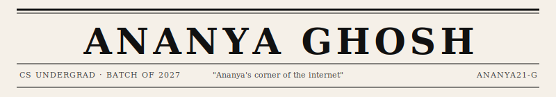

 

### THE STACK · TOOLS OF THE TRADE

**Languages** &nbsp;·&nbsp; Java &nbsp;·&nbsp; JavaScript &nbsp;·&nbsp; C &nbsp;·&nbsp; Python

**Backend** &nbsp;·&nbsp; Spring Boot &nbsp;·&nbsp; REST APIs &nbsp;·&nbsp; JPA &nbsp;·&nbsp; Hibernate

**Databases & Platforms** &nbsp;·&nbsp; PostgreSQL &nbsp;·&nbsp; Supabase &nbsp;·&nbsp; GCP

**Tooling** &nbsp;·&nbsp; Git &nbsp;·&nbsp; GitHub &nbsp;·&nbsp; Maven &nbsp;·&nbsp; Docker &nbsp;·&nbsp; IntelliJ IDEA &nbsp;·&nbsp; VS Code

**Concepts** &nbsp;·&nbsp; OOP &nbsp;·&nbsp; System Design (HLD/LLD) &nbsp;·&nbsp; Scalable Architecture &nbsp;·&nbsp; Version Control

---

### CORRESPONDENCE · GET IN TOUCH

*The editorial desk welcomes letters, collaborations, and interesting problems.*

**Email** &nbsp;·&nbsp; [ananyaghosh.2106@gmail.com](mailto:ananyaghosh.2106@gmail.com)
&nbsp;
**LinkedIn** &nbsp;·&nbsp; [AnanyaGhosh21](https://www.linkedin.com/in/AnanyaGhosh21/)
&nbsp;
**LeetCode** &nbsp;·&nbsp; [Profile](https://leetcode.com/u/qwRn473aIK/)

---
