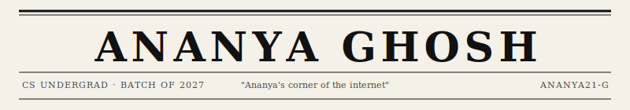

### 💻 Computer Science Student · Backend & Systems Enthusiast

---

## ✨ About Me

- 🎯 Actively seeking 2026 Summer Internship / New Grad opportunities
- 💪 Passionate about backend engineering, scalable architecture, and system design
- 🧠 Deep interest in OOP, HLD/LLD, and distributed systems
- 📩 Feel free to reach out: [ananyaghosh.2106@gmail.com](mailto:ananyaghosh.2106@gmail.com)

---

## Tech Stack

### Languages

### Backend & APIs

### Databases & Platforms

### DevOps & Tooling

---

## 📬 Get In Touch

---
<picture>
  <source media="(prefers-color-scheme: dark)" srcset="https://raw.githubusercontent.com/ronghuang14/ronghuang14/output/pacman-contribution-graph-dark.svg">
  <source media="(prefers-color-scheme: light)" srcset="https://raw.githubusercontent.com/ronghuang14/ronghuang14/output/pacman-contribution-graph.svg">
  
</picture>

*Always learning. Always building.*

